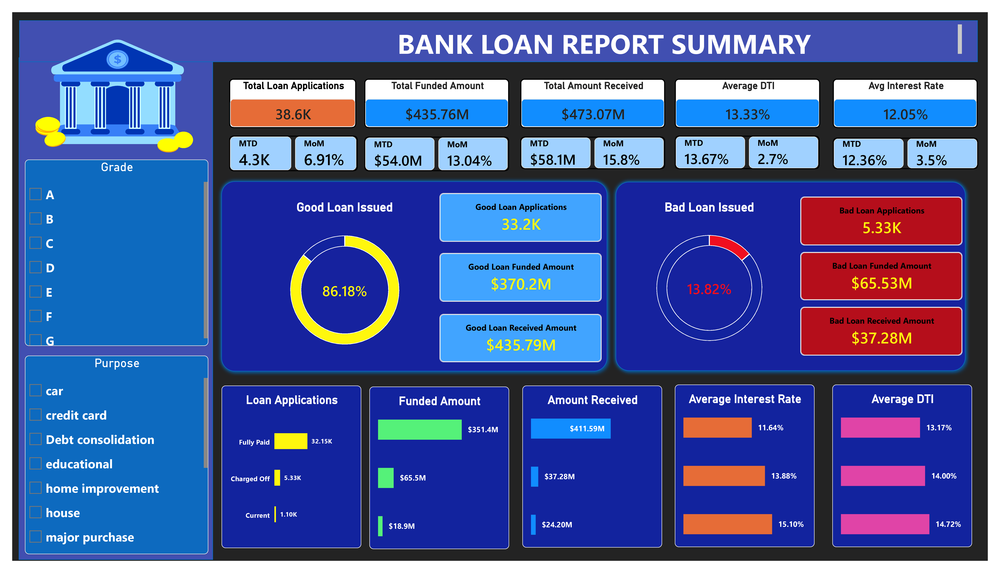
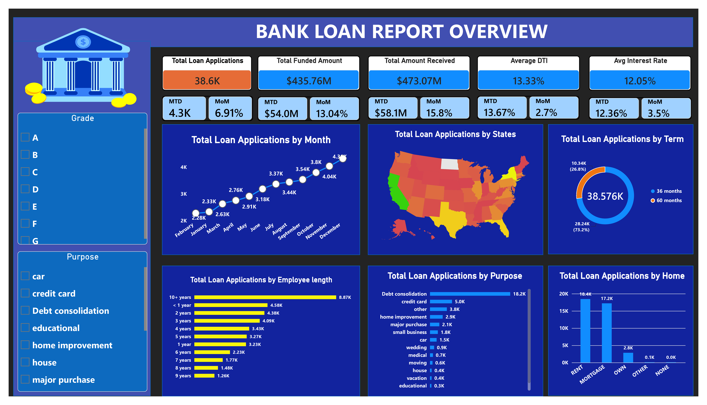

# 🏦 Bank Loan Report | SQL Server & Power BI

**Author:** Vikas Rajbhar
**Tools:** SQL Server, Power BI, DAX, Power Query

## 📌 Overview



This project analyzes a bank's loan portfolio to track lending activity, repayment performance, borrower characteristics, and portfolio risk. The report is built in Power BI and organized into three dashboards: **Summary**, **Overview**, and **Details**.

- **Summary** — headline KPIs and Good Loan vs. Bad Loan performance
- **Overview** — trends and borrower segments (time, geography, term, employment, purpose, home ownership)
- **Details** — a consolidated, record-level view of individual loans

## 🎯 Problem Statement

The goal is to give the bank a single report for monitoring loan applications, disbursements, repayments, interest rates, and borrower debt burden over time — and to make it easy to separate loans by performance and compare lending patterns across key borrower segments.

**Key questions the report answers:**
- How many loan applications were received, and how is that changing month over month?
- How much has been funded, and how much has been received from borrowers?
- What are the average interest rate and debt-to-income (DTI) ratio?
- What share of applications are Good Loans vs. Bad Loans?
- How do loan metrics vary by status and by borrower segment?

## 🗂️ Dataset

Loan-level data with borrower, credit, and repayment attributes.

| Column | Description |
|---|---|
| `id` | Loan record identifier |
| `member_id` | Borrower/member identifier |
| `address_state` | Borrower state |
| `application_type` | Type of application |
| `emp_title` | Borrower's employment title |
| `emp_length` | Borrower's employment length |
| `home_ownership` | Home ownership category |
| `annual_income` | Borrower's annual income |
| `verification_status` | Income verification status |
| `issue_date` | Date the loan was issued |
| `loan_status` | Current loan status |
| `last_payment_date` | Date of the last payment |
| `next_payment_date` | Scheduled next payment date |
| `last_credit_pull_date` | Most recent credit pull date |
| `grade` / `sub_grade` | Loan grade / detailed grade |
| `purpose` | Loan purpose |
| `term` | Loan term |
| `loan_amount` | Original loan amount |
| `installment` | Scheduled installment amount |
| `int_rate` | Interest rate |
| `dti` | Debt-to-income ratio |
| `total_acc` | Total credit accounts |
| `total_payment` | Total payments received |

**Fields used most in analysis:** `id`, `issue_date`, `loan_status`, `loan_amount`, `total_payment`, `int_rate`, `dti`, `address_state`, `term`, `emp_length`, `purpose`, `home_ownership`.

## 🧹 Data Preparation

Performed in Power Query and the data model:

- Set `issue_date` and other date fields to the Date type; set amount/numeric fields to appropriate numeric types.
- Created a **Good vs Bad Loan** classification column:
  - **Good Loan:** `Fully Paid` or `Current`
  - **Bad Loan:** `Charged Off`
- Built a standalone Calendar table, marked as a date table, joined to `financial_loan_data[issue_date]`, to support time-intelligence measures.
- Created a month-name field sorted by month number so months display in calendar order; where data spans multiple years, used a Year-Month field to avoid mixing the same month across years.

> DAX below references the table `financial_loan_data` and column `Good vs Bad Loan`. Update names if your model differs.

## 🧮 DAX Measures

### Core KPIs

```dax
Total Loan Applications = COUNT(financial_loan_data[id])

Total Funded Amount = SUM(financial_loan_data[loan_amount])

Total Amount Received = SUM(financial_loan_data[total_payment])

Average Interest Rate = AVERAGE(financial_loan_data[int_rate])

Average DTI = AVERAGE(financial_loan_data[dti])
```

If `int_rate` and `dti` are stored as decimal fractions (e.g., `0.1527` = 15.27%), apply percentage formatting rather than multiplying by 100.

### Month-to-Date (MTD)

```dax
MTD Loan Applications = CALCULATE([Total Loan Applications], DATESMTD('Calendar'[Date]))

MTD Funded Amount = CALCULATE([Total Funded Amount], DATESMTD('Calendar'[Date]))

MTD Received Amount = CALCULATE([Total Amount Received], DATESMTD('Calendar'[Date]))

MTD Average Interest Rate = CALCULATE([Average Interest Rate], DATESMTD('Calendar'[Date]))

MTD Average DTI = CALCULATE([Average DTI], DATESMTD('Calendar'[Date]))
```

### Previous Month-to-Date (PMTD)

```dax
PMTD Loan Applications =
CALCULATE([Total Loan Applications], DATEADD(DATESMTD('Calendar'[Date]), -1, MONTH))

PMTD Funded Amount =
CALCULATE([Total Funded Amount], DATEADD(DATESMTD('Calendar'[Date]), -1, MONTH))

PMTD Received Amount =
CALCULATE([Total Amount Received], DATEADD(DATESMTD('Calendar'[Date]), -1, MONTH))

PMTD Average Interest Rate =
CALCULATE([Average Interest Rate], DATEADD(DATESMTD('Calendar'[Date]), -1, MONTH))

PMTD Average DTI =
CALCULATE([Average DTI], DATEADD(DATESMTD('Calendar'[Date]), -1, MONTH))
```

**Model note:** requires a continuous Calendar table with an active relationship to `issue_date`, marked as a date table. If MTD/PMTD cards are blank or zero, check the date filter context first.

### Month-over-Month (MoM) Change

```dax
MoM Loan Applications Change = [MTD Loan Applications] - [PMTD Loan Applications]

MoM Loan Applications % =
DIVIDE([MTD Loan Applications] - [PMTD Loan Applications], [PMTD Loan Applications], 0)

MoM Funded Amount % =
DIVIDE([MTD Funded Amount] - [PMTD Funded Amount], [PMTD Funded Amount], 0)

MoM Received Amount % =
DIVIDE([MTD Received Amount] - [PMTD Received Amount], [PMTD Received Amount], 0)

MoM Interest Rate Change = [MTD Average Interest Rate] - [PMTD Average Interest Rate]

MoM Interest Rate % =
DIVIDE([MTD Average Interest Rate] - [PMTD Average Interest Rate], [PMTD Average Interest Rate], 0)

MoM DTI Change = [MTD Average DTI] - [PMTD Average DTI]

MoM DTI % =
DIVIDE([MTD Average DTI] - [PMTD Average DTI], [PMTD Average DTI], 0)
```

Format percentage-change measures as Percentage. For interest rate and DTI, show both the absolute (percentage-point) and relative change, clearly labeled.

### Good Loan / Bad Loan KPIs

```dax
Good Loan % =
DIVIDE(
    CALCULATE(COUNT(financial_loan_data[id]), financial_loan_data[Good vs Bad Loan] = "Good Loan"),
    COUNT(financial_loan_data[id]), 0
)

Bad Loan % =
DIVIDE(
    CALCULATE(COUNT(financial_loan_data[id]), financial_loan_data[Good vs Bad Loan] = "Bad Loan"),
    COUNT(financial_loan_data[id]), 0
)

Good Loan Applications =
CALCULATE(COUNT(financial_loan_data[id]), financial_loan_data[Good vs Bad Loan] = "Good Loan")

Good Loan Funded Amount =
CALCULATE(SUM(financial_loan_data[loan_amount]), financial_loan_data[Good vs Bad Loan] = "Good Loan")

Good Loan Received Amount =
CALCULATE(SUM(financial_loan_data[total_payment]), financial_loan_data[Good vs Bad Loan] = "Good Loan")

Bad Loan Applications =
CALCULATE(COUNT(financial_loan_data[id]), financial_loan_data[Good vs Bad Loan] = "Bad Loan")

Bad Loan Funded Amount =
CALCULATE(SUM(financial_loan_data[loan_amount]), financial_loan_data[Good vs Bad Loan] = "Bad Loan")

Bad Loan Received Amount =
CALCULATE(SUM(financial_loan_data[total_payment]), financial_loan_data[Good vs Bad Loan] = "Bad Loan")
```

**Donut chart setup:** `Good vs Bad Loan` on Legend, `id` (Count) on Values, with percentage data labels enabled.

## 📊 Dashboards

### 1. Summary

- **Headline KPI cards:** Total Loan Applications, Total Funded Amount, Total Amount Received, Average Interest Rate, Average DTI — each with MTD and MoM
- **Good vs Bad Loan section:** application share, application count, funded amount, and received amount for each category, plus a donut chart of the split
- **Loan Status grid:** by `loan_status` — applications, funded amount, amount received, MTD funded amount, MTD amount received, average interest rate, average DTI

### 2. Overview



| Visual | Category / Axis | Measures |
|---|---|---|
| Monthly trends (line chart) | Month from `issue_date` | Applications, funded amount, amount received |
| Regional analysis (filled map) | `address_state` | Applications, funded amount, amount received |
| Loan term (donut chart) | `term` | Applications, funded amount, amount received |
| Employment length (bar chart) | `emp_length` | Applications, funded amount, amount received |
| Loan purpose (bar chart) | `purpose` | Applications, funded amount, amount received |
| Home ownership (treemap) | `home_ownership` | Applications, funded amount, amount received |

For the monthly trend, sort month names by month number. For the map, confirm the state field is set as a geographic category.

### 3. Details

A searchable, record-level view: Loan ID, issue date, state, loan status, grade/sub-grade, purpose, term, employment length, home ownership, annual income, DTI, interest rate, loan amount, installment, and total payment, with slicers for filtering.

## 🔍 Report Findings

Based on the Summary and Overview dashboards. The Details dashboard is a record-level view and isn't summarized here.

### Headline metrics

| Metric | Overall | MTD | MoM |
|---|---|---|---|
| Total Loan Applications | 38.6K | 4.3K | +6.91% |
| Total Funded Amount | $435.76M | $54.0M | +13.04% |
| Total Amount Received | $473.07M | $58.1M | +15.8% |
| Average Interest Rate | 12.05% | 12.36% | +3.5% |
| Average DTI | 13.33% | 13.67% | +2.7% |

Applications, funded amount, and amount received all increased month over month, with received amount growing fastest. Average interest rate and DTI also rose slightly.

### Good Loans vs. Bad Loans

| Metric | Good Loans (Fully Paid + Current) | Bad Loans (Charged Off) |
|---|---|---|
| Share of applications | 86.18% | 13.82% |
| Applications | 33.2K | 5.33K |
| Funded amount | $370.2M | $65.53M |
| Amount received | $435.79M | $37.28M |

Received amount is roughly 1.18× funded amount for Good Loans and roughly 0.57× funded amount for Bad Loans. This is a simple portfolio-level comparison, not a full profit/loss calculation.

### Loan status breakdown

| Status | Applications | Funded | Received | Avg. Interest Rate | Avg. DTI |
|---|---|---|---|---|---|
| Fully Paid | 32.15K | $351.4M | $411.59M | 11.64% | 13.17% |
| Charged Off | 5.33K | $65.5M | $37.28M | 13.88% | 14.00% |
| Current | 1.10K | $18.9M | $24.20M | 15.10% | 14.72% |

Charged-off loans show higher average interest rate and DTI than fully paid loans; Current loans show the highest of both. These are associations within this dataset, not evidence of causation.

### Trends and segments

- **Monthly applications:** grew from roughly 2.3K early in the year to about 4.3K in December. Verify chronological month sorting before drawing trend conclusions.
- **State:** California has the highest volume, followed by Texas, New York, and Florida. North Dakota shows minimal activity.
- **Loan term:** 36 months — 28.24K applications (73.2%); 60 months — 10.34K (26.8%).
- **Employment length:** 10+ years is the largest group (8.87K), followed by under 1 year (4.58K) and 2 years (4.38K).
- **Purpose:** Debt consolidation leads at 18.2K (~47%), followed by credit card (5.0K), other (3.8K), and home improvement (2.9K).
- **Home ownership:** Rent (18.4K) and Mortgage (17.2K) dominate, followed by Own (2.8K) — together, Rent and Mortgage make up about 92% of applications.

## 🔭 Suggested Follow-up Analysis

- Compare charged-off rates by grade, sub-grade, purpose, term, and DTI band.
- Track charged-off volume and share by issue month and state.
- Monitor Current loans over time, since their final outcome isn't yet known.
- Validate month sorting and calendar relationships before relying on time-based comparisons.
- Reconcile totals and percentages across summary cards, the status grid, and visuals.

## ⚠️ Notes and Limitations

- Good Loan = Fully Paid + Current; Bad Loan = Charged Off, per the project definition.
- A "Current" status is not a final outcome — it may change later.
- "Amount received minus funded amount" is a simple arithmetic comparison, not a complete profit/loss figure (it doesn't account for timing, accrued interest, expenses, or recoveries).
- MTD/PMTD comparisons use the comparable elapsed portion of each month, not the full previous calendar month.

## 🛠️ Skills Demonstrated

- Data preparation and type handling in Power Query
- Data modeling and time-intelligence with a dedicated Calendar table
- DAX measures using `CALCULATE`, `DIVIDE`, `AVERAGE`, `SUM`, `COUNT`, `DATESMTD`, `DATEADD`
- KPI design and month-over-month analysis
- Portfolio segmentation and loan-status analysis
- Dashboard design and insight communication in Power BI
